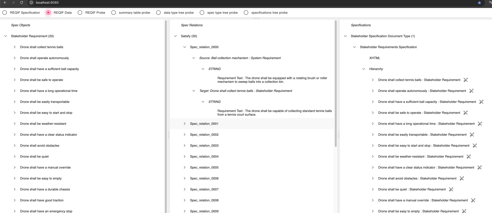

# GongReqif - ReqIF File Analyzer

[](https://go.dev/doc/install)
[](https://opensource.org/licenses/MIT)

GongReqif is a command-line tool for analyzing and inspecting OMG ReqIF (Requirements Interchange Format) files. You can easily browse or drop your `.reqif` or `.reqifz` files to get a structured view of the requirements data.




## About the Project

The Requirements Interchange Format (ReqIF) is an open, XML-based standard used to exchange requirements between different software tools, particularly in the automotive, aerospace, and defense industries. A `.reqif` file is a single XML file, while a `.reqifz` is a compressed archive containing the `.reqif` file and associated attachments, such as images.

GongReqif provides a simple interface to parse and visualize the hierarchical structure, attributes, and relationships within these requirement files, facilitating a quick and clear analysis without needing complex enterprise software.

## Getting Started

To get a local copy up and running, follow these simple steps.

### Prerequisites

You need to have Go version 1.24 or higher installed on your system. You can find the installation instructions on the official Go website:

- [Go Installation Guide](https://go.dev/doc/install)

### Installation & Running the Application

You can run the application directly from the source using the `go run` command. This command will fetch the package and its dependencies and execute the main command.

```sh
go run https://github.com/fullstack-lang/gongreqif/go/cmd/gongreqif@main
```

## Usage

Once the application is running, it will open a window where you can interact with your ReqIF files.

1.  **Open a file:** You can either drag and drop a `.reqif` or `.reqifz` file directly onto the application window.
2.  **Browse for a file:** Alternatively, you can click the "Browse" button to open a file dialog and select your desired ReqIF file.

The application will then process the file and display its contents for analysis.

## Contributing

Contributions are what make the open-source community such an amazing place to learn, inspire, and create. Any contributions you make are **greatly appreciated**.

If you have a suggestion that would make this better, please fork the repo and create a pull request. You can also simply open an issue with the tag "enhancement".

1.  Fork the Project
2.  Create your Feature Branch (`git checkout -b feature/AmazingFeature`)
3.  Commit your Changes (`git commit -m 'Add some AmazingFeature'`)
4.  Push to the Branch (`git push origin feature/AmazingFeature`)
5.  Open a Pull Request

## License

Distributed under the MIT License. See `LICENSE` for more information.